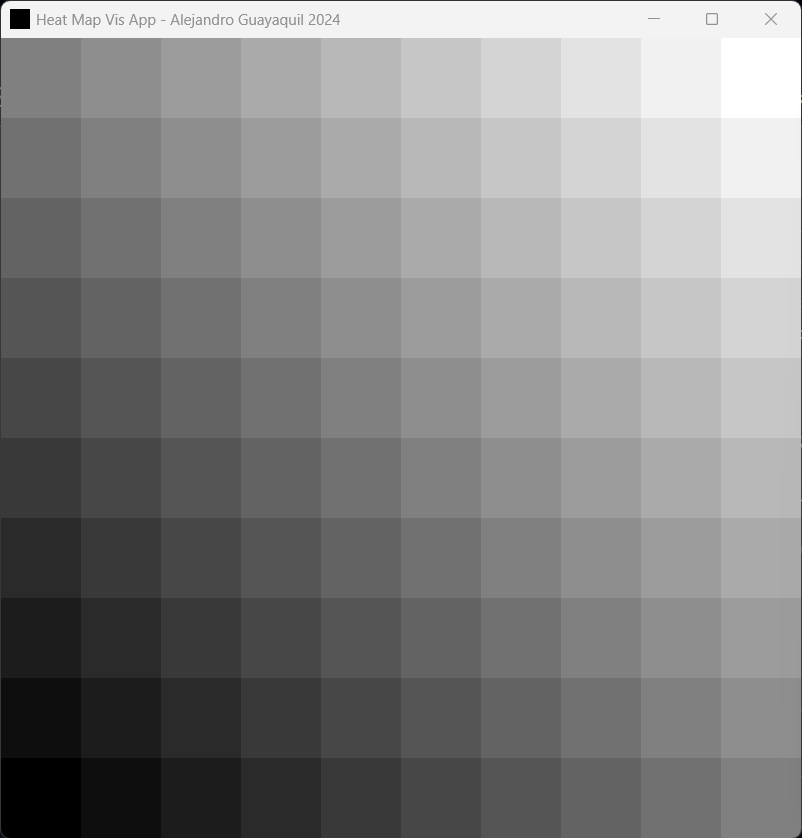

## Document Scope

The following are the steps I used to solve this [*Graphics Challenge Problem*](https://colab.research.google.com/drive/18xE6icoAdhLrMLZggKaYMHB3tBMqt1Y_?usp=sharing#scrollTo=MADwnenA2nwV) (If the hyperlink does not work the TLDR of the problem is to <u>create a C++ program using OpenGL that visualizes a 2D scalar field as a heatmap</u>).

### Development Environment
* Windows 11 OS : What I have as a personal computer
* Visual Studio 2022 Community : Provides a C++ compiler on Windows.
* Visual Studio Code : For developing (code editor, file system, terminal, etc.)
* CMake 3.0+ : Common way of doing OS-independent project.
* GLFW : Handles OS windowing system.
* GLAD : Enables OpenGL extensions (required for things like shaders).
* GLM : To have performant graphics math that is common on C++ and GLSL.

### How To Run The App
```
git clone https://github.com/guayabas/HeatMapVis.git heatmapvis
cd heatmapvis
mkdir build

# Window - PowerShell
cmake -S . -B .\build\ -Wno-dev ; cmake --build .\build\ ; .\build\Debug\HeatMapVis.exe

# Unix - Shell
cmake -S . -B .\build\ -Wno-dev && cmake --build .\build\ && .\build\Debug\HeatMapVis
```

### What Is A 2D Scalar Field?
<details><summary>Show Content</summary>

If you are not familiar with calculus or physics, then you can think of a 2D scalar field as the values that the basic game Tic-tac-toe (The one that one puts a circle or a cross), i.e. a 2D scalar field is simply the values that take a cell in a grid.

Not relevant for this project but scalar fields are important because represent relevant information for physics like temperature or pressure. You can read more about it in the Wikipedia https://en.wikipedia.org/wiki/Scalar_field or ask some AI like ChatGPT.

What is important for the taks at hand is to do a program that is able to display (and to some extent generate) images like this one
<p align="center"></p>

</details>

### 1. Generate a 2D Scalar Field
<details><summary>Show Content</summary>

This can be done easily by just creating a 2D grid and then assigning a value at each grid point.
```Cpp
namespace Math
{
    struct ScalarField2D
    {
        ScalarField2D(int width, int height) : width(width), height(height)
        {
            data.resize(width * height);
        }
        std::vector<float> data;
        int width = -1;
        int height = -1;
    };

    ScalarField2D generate_XXX_2DScalarField(int width = 10, int height = 10)
    {
        assert(width > 0 && height > 0);
        ScalarField2D result(width, height);
        for (int i = 0; i < width; i++)
        {
            for (int j = 0; j < height; j++)
            {
                result.data[i + (j * width)] = f(i, j);
            }
        }
        return result;
    }    
}
```

The important aspects about above code is the line 
```Cpp
result.data[i + (j * width)] = f(i, j)
```

because it does something named *linear indexing* which converts a 2D index into a 1D index. Nothing stops for doing something like `result.data[i][j]` (which will require a `std::vector<std::vector<float>>` as data container) but part of doing efficient programming is to be aware that having compact data in memory is _mostly_ always better than having it sparse. Notice that yes, we could have done `j + (i * height)` for the linear indexing (and yes, will have some consequences in memory alignment) but that is left as possible exercise for you the reader.

The other relevant aspect is the function `f(i, j)` which will represent the <u>2D scalar field</u> that we are interested to display. In the Python reference this line of code is equivalent to
```Python
z = np.sin(x**2 + y**2)
```

Obviously, `f(i, j)` is not actual code, so let me show you how it will look for a <u>constant scalar field</u>
```Cpp
ScalarField2D generateConstant2DScalarField(int width = 10, int height = 10, float value = 0.0f)
{
    assert(width > 0 && height > 0);
    ScalarField2D result(width, height);
    for (int i = 0; i < width; i++)
    {
        for (int j = 0; j < height; j++)
        {
            result.data[i + (j * width)] = value;
        }
    }
    return result;
}
```
</details>

### 2. Color Map The Scalar Field
<details><summary>Show Content</summary>

To do this we simply need to do 

* Define a color scheme (for example, as suggested use two colors)
* Assign color to grid points based on the color scheme and *interpolate* values in between grid points.


Why is the interpolation needed? Well, the monitor (or any other device to display some graphics) will be composed of pixels and nothing tells you that one pixel is map exactly to one grid node. We can do all this in the CPU side but is better to use the GPU capabilities for it.

For this, we have to introduce two things
1. Passing data from the CPU to GPU
2. Shaders (specifically the fragment shader)

#### Passing Data From CPU To GPU
What we want is basically to move the `std::vector<float> data` from the `ScalarField2D` data structure into the GPU. To do so one can use the concept of *textures* in the graphics world. These are not more than buffers of GPU memory that can have different dimensions (commonly 1D, 2D, or 3D) and data types (such as int, float, or even 3|4 components -commonly used as RGB|A channels-).

In OpeGL this can be done like

```Cpp
namespace Graphics
{
    unsigned int createTexture(const Math::ScalarField2D & data)
    {
        unsigned int textureID = 0;
        glGenTextures(1, &textureID);
        glBindTexture(GL_TEXTURE_2D, textureID);
        glTexParameteri(GL_TEXTURE_2D, GL_TEXTURE_WRAP_S, GL_CLAMP_TO_EDGE);
        glTexParameteri(GL_TEXTURE_2D, GL_TEXTURE_WRAP_T, GL_CLAMP_TO_EDGE);
        glTexParameteri(GL_TEXTURE_2D, GL_TEXTURE_MIN_FILTER, GL_NEAREST);
        glTexParameteri(GL_TEXTURE_2D, GL_TEXTURE_MAG_FILTER, GL_NEAREST);
        glTexImage2D(GL_TEXTURE_2D, 0, GL_R32F, data.width, data.height, 0, GL_RED, GL_FLOAT, &(data.data[0]));
        glBindTexture(GL_TEXTURE_2D, 0);
        return textureID;
    }
}
```

If you are not familiar with OpenGL, take a look [here](https://learnopengl.com/). And the important aspect of above code is the line 
```Cpp
glTexImage2D(GL_TEXTURE_2D, 0, GL_R32F, data.width, data.height, 0, GL_RED, GL_FLOAT, &(data.data[0]));
```
since that would be the one that defines the mapping from CPU data into GPU data. A note is that the actual transfer of the bytes does not necessarily (depends on how OpenGL is setup as well the implementation of the graphics driver) happens at that line of the code.

#### Shaders
Now the data is at the GPU but then how can we manipulate it? This is where the *shaders* come in handy. As a simple explanation, shaders are *small* pieces of code (written in a shading language, for example GLSL for OpenGL) that do things on the GPU in parallel. We don't need to go into details how a graphics pipeline works (in you want to go into that rabbit hole take a look [here](https://www.khronos.org/opengl/wiki/Rendering_Pipeline_Overview)) but only to mention that the *two important* shaders are the <u>vertex</u> and <u>fragment</u> shaders. In few words, the vertex one processes vertices (geometry) while the fragment one processes pixels (colors).

For the purpose of the task, here is the fragment shader that does the *magic* of coloring the 2D scalar field
```GLSL
#version 330 core
in vec2 vTextureCoordinates;
uniform sampler2D uTextureSampler;
uniform float uScalarFieldMax;
uniform float uScalarFieldMin;
out vec4 fragColor;
vec3 getColorForValue(float value) 
{
    vec3 coldColor = vec3(0.0, 0.0, 0.0);
    vec3 hotColor = vec3(1.0, 1.0, 1.0);
    float normalized = (value - uScalarFieldMin) / (uScalarFieldMax - uScalarFieldMin);
    return mix(coldColor, hotColor, normalized);
}
void main()
{
    float colorFromTexture = texture(uTextureSampler, vTextureCoordinates).r;
    fragColor = vec4(getColorForValue(colorFromTexture), 1.0);
}
```
Notice that the color scheme is at the line
```GLSL
mix(coldColor, hotColor, normalized)
```
which does a linear interpolation between those two colors provided a value.

That is great you think, but what are the `vTextureCoordinates`? Those are simply a *coordinate space* that ranges between 0 and 1 (commonly known as UV space). You are familiar with a coordinate space since elementary school which is the real coordinate space that say things like *a point is at the position (10, 25)*. To understand a little more about UV space just imagine a square, you can define it via its geometrical points (a = [-1, -1], b = [-1, 1],  c = [1, 1], d = [1, -1]) but also via its texture points (uv_a = [0, 0], uv_b = [1, 0], uv_c = [1, 1], uv_d = [0, 1])
</details>

### 3. Render The Heatmap Using OpenGL.
<details><summary>Show Content</summary>

This has its own difficulties but to keep it simple these are the steps to make a program using OpenGL
1. Create a window in the OS (the purpose of GLFW library).
2. Enable OpenGL extensions to have access to modern OpenGL like Buffer Objects, Shaders, etc.
3. Make a quad/rectangle, it serves as a *canvas* for the scalar field, and pass it to the GPU.
4. Generate the scalar field and pass it to the GPU.
5. Display the quad using a shader.

#### 1. Create Window
The easiest is to go to GLFW website and its [documentation](https://www.glfw.org/documentation.html) the base of how to open a window is provided. Here it is
```Cpp
#include <GLFW/glfw3.h>
int main(void)
{
    GLFWwindow * window;
    if (!glfwInit())
    {
        return -1;
    }
    window = glfwCreateWindow(640, 480, "Hello World", NULL, NULL);
    if (!window)
    {
        glfwTerminate();
        return -1;
    }
    glfwMakeContextCurrent(window);
    while (!glfwWindowShouldClose(window))
    {
        glClear(GL_COLOR_BUFFER_BIT);
        glfwSwapBuffers(window);
        glfwPollEvents();
    }
    glfwTerminate();
    return 0;
}
``` 
Nothing fancy happening here, just a creation of a pointer (`glfwCreateWindow`) that serves as our memory handle of the window. The line `glClear(GL_COLOR_BUFFER_BIT)` is not even *necessary* to just display the window, but it is required to make the app refresh its content at every tick.


#### 2. Enable OpenGL Extensions
This can be done with something like
```Cpp
#include <glad/gl.h>
int main(int, char **)
{
    // Window initialization/assign context before here ...
    std::cout << "Loading GL extensions\n";
    if (!gladLoadGL(glfwGetProcAddress))
    {
        std::cerr << "Error at gladLoadGL()\n";
        glfwDestroyWindow(window);
        glfwTerminate();
        return -1;
    }
    // Clean the program here after the main loop
}
```

This inoccent looking portion of code does a lot since it provides definitions to functions like `glShaderSource`, `glVertexAttribPointer`, `glUseProgram`, etc. which are the heart of using modern OpenGL. One clarification is that this `gladLoadGL` <u>needs</u> to be called after assigning a *context* (with `glfwMakeContextCurrent`) to the window. What is a context is way beyond the scope of this problem but the short answer is that it defines the characteristics of the canvas layer to use for the rendering (characteristics are things like: number of bytes in the buffer? which thread to use for processing? On which GPU you are going to do your rendering? etc.). If you want to learn more about it, check the OpenGL documentation, or even better, nowadays OpenGL is somehow old for GPU rendering and other pipelines (that provide more control to the programmer) are on the field (such as Vulkan, Metal, or DirectX), so take a look of how to do rendering with those APIs, there a context is something that one has to write explicitly in C/C++.

#### 3. Make A Quad

This task is in the following code
```Cpp
#include <glm/glm.hpp>
#include <vector>
namespace Geometry
{
    struct Data4D
    {
        std::vector<glm::vec4> vertices;
        std::vector<unsigned int> indices;
    };
    Data4D createRectangleWithTexture(float width, float height, glm::vec2 center)
    {
        Data4D result;
        result.vertices.reserve(4);
        result.indices.reserve(6);
        result.vertices.push_back(glm::vec4(glm::vec2(-width * 0.5f, +height * 0.5f) + center, glm::vec2(0.0f, 1.0f)));
        result.vertices.push_back(glm::vec4(glm::vec2(+width * 0.5f, +height * 0.5f) + center, glm::vec2(1.0f, 1.0f)));
        result.vertices.push_back(glm::vec4(glm::vec2(+width * 0.5f, -height * 0.5f) + center, glm::vec2(1.0f, 0.0f)));
        result.vertices.push_back(glm::vec4(glm::vec2(-width * 0.5f, -height * 0.5f) + center, glm::vec2(0.0f, 0.0f)));
        result.indices.push_back(0);
        result.indices.push_back(1);
        result.indices.push_back(2);
        result.indices.push_back(2);
        result.indices.push_back(3);
        result.indices.push_back(0);
        return result;
    }
}
```
So what does that code do? Simple, given the container `vertices` and `indices` it populates them with the values you see there. What do those value mean? Well, when thining in how to draw a rectangle (or aka quad), one has two dimensions to play with, a `width` and a `height`. Additionaly, the geometry does not need to be in the center/origin, so another parameter to play would be that position (`center`). The only to pay attention in above code is that we have a `0.5f` factor and that we use the `glm::vec2()` object. The former is to make the geometry symmetric respect to the center, while the latter is that UV space we talk before. 

#### 4. Generate Scalar Field

This has been already explained in previous section (Color Map The Scalar Field)

#### 5. Display The Quad

Last part is the most satisfying one. Finally seeing things on the screen, to do so there are two tasks to tackle

1. Read the shaders
2. Use the shaders

For the reading we have this function
```Cpp
namespace Graphics
{
    int loadShader(const char * vertexShaderSource, const char * fragmentShaderSource)
    {
        int success = 0;
        char infoLog[512] = { 0 };
        unsigned int vertexShader = glCreateShader(GL_VERTEX_SHADER);
        glShaderSource(vertexShader, 1, &vertexShaderSource, nullptr);
        glCompileShader(vertexShader);
        glGetShaderiv(vertexShader, GL_COMPILE_STATUS, &success);
        if (!success)
        {
            glGetShaderInfoLog(vertexShader, 512, nullptr, infoLog);
            printf("Failed to compile vertex shader %s\n", infoLog);
            return -1;
        }
        CONSOLE_LOG("Vertex shader compiled\n");
        unsigned int fragmentShader = glCreateShader(GL_FRAGMENT_SHADER);
        glShaderSource(fragmentShader, 1, &fragmentShaderSource, nullptr);
        glCompileShader(fragmentShader);
        glGetShaderiv(fragmentShader, GL_COMPILE_STATUS, &success);
        if (!success)
        {
            glGetShaderInfoLog(fragmentShader, 512, nullptr, infoLog);
            printf("Failed to compile fragment shader %s\n", infoLog);
            return -1;
        }
        CONSOLE_LOG("Fragment shader compiled\n");
        unsigned int shaderProgram = glCreateProgram();
        glAttachShader(shaderProgram, vertexShader);
        glAttachShader(shaderProgram, fragmentShader);
        glLinkProgram(shaderProgram);
        glGetProgramiv(shaderProgram, GL_LINK_STATUS, &success);
        if (!success)
        {
            glGetProgramInfoLog(shaderProgram, 512, nullptr, infoLog);
            printf("Failed to link program %s\n", infoLog);
            return -1;
        }
        glDeleteShader(vertexShader);
        glDeleteShader(fragmentShader);
        CONSOLE_LOG("Shader program %d linked correctly\n", shaderProgram);
        return shaderProgram;
    }    
}
```

which simply grabs the string for each shader (remember has to a `vertex` and a `fragment`), does the compilation, and then its linking into a program that we can use in OpenGL (If the compiling/linking mechanism makes you think of a compiled language, like C/C++, you are right, it is the same concept behind ... to some extent).

Lastly, the drawing is simply the following call
```Cpp
int main(int, char **)
{
    // All previous code of creating GLFW window, adding OpenGL extensions, making quad geometry and the scalar field
    while(!glfwWindowShouldClose(window))
    {
        glfwPollEvents();
        glClear(GL_COLOR_BUFFER_BIT);
        glUseProgram(shaderProgramID);
        glActiveTexture(GL_TEXTURE0);
        glBindTexture(GL_TEXTURE_2D, textureID);
        glBindVertexArray(graphicsBuffers.VAO);
        glDrawElements(GL_TRIANGLES, quadGeometry.indices.size(), GL_UNSIGNED_INT, 0);
        glBindVertexArray(0);
        glUseProgram(0);
        glfwSwapBuffers(window);
    }
    // Finish by cleaning whatever buffers and objects you created before the main loop
}
```

The *relevant* lines are `glUseProgram` and `glDrawElements` (not that the remaining lines are useless, they are also important but these ones *control* that we want to display a quad).

</details>

### Optional Tasks
<details><summary>Show Content</summary>

For the following task does not have code (yet, limited time to finish this challenge as tech interview) but here are ideas on how to implement them given this framework

#### Loading 2D Scalar Field From External File

Since the scalar field is nothing more than just a bunch of values for a 2D grid, one could create a function that reads each value sequentially and the just put it in the `ScalarField2D` structure provided. Difficulties of this task are in
* Which is a default file format for a scalar field? It is something like as standard value like a PNG for an image?
* How do we know the dimensions of the scalar field? If we get just a stream of numbers then where do the cut to say "this field is N x M"
* The assumption for `ScalarField2D`is to be of type `float32`, but what if the scalar field is in `int` data type?

#### Adding Camera

Given our solution there are two ways to go for a camera
1. One that does zoom but never escapes the max far distance of the quad entirely on the canvas window
2. Be more free and let the camera pan *beyond* the quad geometry

For both cases we need to introduce the concept of a geometric transformations (specially translations) which in the world of math can be represented with matrices. These report is not a topic about linear algebra so let's just put the important steps that connect how to add a camera to the app
```Cpp
// 3D Graphics require 3 specific transformations, a model matrix, a view matrix, and a projections matrix
// The first two work sort of similar that make things to move/scale/rotate/etc (even old OpenGL have the concept of glMatrixMode(GL_MODELVIEW))
// Considering this, a camera for this problem can be done by simply doing a translation in the XY plane (for the pan action) and a translation in Z line
// (for the zoom action).
// More about this transformations and about the math behind all of them can be found here https://www.songho.ca/opengl/gl_transform.html
```

#### Improve Current Coloring

The current heatmap is done only with two colors and a linear interpolation between them, but if you notice, the first image in this document has beautiful and bright colors (not just boring black, white, and grays). One can indeed just change the white and black ends of the linear interpolation to something like red and blue, but that still is just a two color scheme. If you notice in this [website](https://matplotlib.org/stable/users/explain/colors/colormaps.html), `matplotlib` of Python provides other color schemes, how to do them?

One way is to use a look-up table and generate a hash index based on the normalized value of a point in the grid, it should be something like
```Cpp
std::vector<std::array<float, 3>> viridisColormap = {
    {0.267004, 0.004874, 0.329415},
    {0.268510, 0.885260, 0.450100},
    {0.165254, 0.884905, 0.450100},
    {0.991772, 0.586234, 0.243535},
    {0.993248, 0.904648, 0.525099},
    {0.427643, 0.054807, 0.058128},
    {0.990174, 0.977715, 0.444556},
    {0.870334, 0.194903, 0.037832},
};
std::array<float, 3> getViridisColor(float value, float minValue, float maxValue) {
    float normalized = (value - minValue) / (maxValue - minValue);
    normalized = std::clamp(normalized, 0.0f, 1.0f);
    size_t index = static_cast<size_t>(normalized * (viridisColormap.size() - 1));
    return viridisColormap[index];
}
```
</details>

### Solution

Here are some images comparison between the ones created with the Python code provided as reference (right image) and the ones created with the solution of this repository (left image)

<details><summary>Constant : f(x, y) = 0</summary>
Grid Size : (10, 10)
<p align="center">
    
    
</p>
</details>

<details><summary>Linear X : f(x, y) = x</summary>
Grid Size : (10, 10)
<p align="center">
    
    
</p>
Grid Size : (100, 100)
<p align="center">
    
    
</p>
</details>

<details><summary>Linear XY : f(x, y) = (x + y)</summary>
Grid Size : (10, 10)
<p align="center">
    
    
</p>
Grid Size : (100, 100)
<p align="center">
    
    
</p>
</details>

<details><summary>Quadratic : f(x, y) = (x * x + y * y)</summary>
Grid Size : (10, 10)
<p align="center">
    
    
</p>
Grid Size : (100, 100)
<p align="center">
    
    
</p>
</details>

<details open><summary>Provided Example : f(x, y) = sin(x * x + y * y)</summary>
Grid Size : (10, 10)
<p align="center">
    
    
</p>
Grid Size : (100, 100)
<p align="center">
    
    
</p>
</details>

<details><summary>Video Of App Running</summary>
    <p align="center">
        <video width="800" height="600" controls>
            <source src="./resources/videos/solution.mp4" type="video/mp4">
            Your browser does not support the video tag.
        </video>
    </p>
</details>
